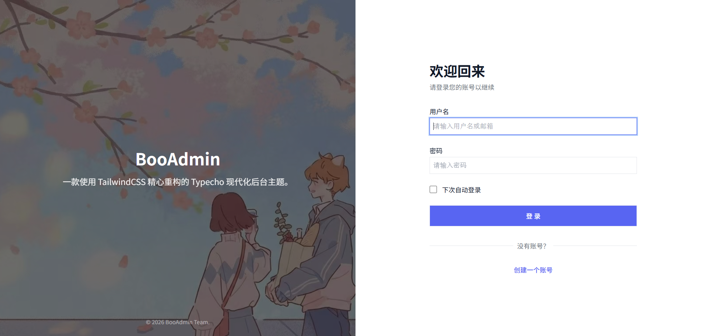

# Gbr's Blog

Gbr's Blog 是一个基于 Tailwind CSS 重构的 Typecho 后台主题，适用于 Typecho 1.3.0。

项目仓库：https://github.com/gongbangrui/TypechoAdmin



## 特性

- 现代化后台界面与响应式布局
- 支持浅色和深色显示模式
- 针对桌面端与移动端优化的管理页面
- 覆盖控制台、文章、页面、评论、媒体、用户和系统设置等后台界面
- 使用 Tailwind CSS 构建样式，并集成常用的图表、进度条和公式渲染资源

## 安装

在替换后台文件前，请备份网站数据库和现有的 `admin` 目录。

1. 下载或克隆本仓库。
2. 将仓库中的 `admin` 目录上传到 Typecho 网站根目录。
3. 覆盖现有的 `admin` 目录。
4. 登录 Typecho 后台确认界面和功能正常。

## 升级

1. 备份网站数据库和当前 `admin` 目录。
2. 用本仓库的 `admin` 目录覆盖服务器上的对应目录。
3. 清除浏览器缓存后重新登录后台。

## 目录结构

```text
admin/       Typecho 后台主题文件
config/      Tailwind CSS 源文件与配置
screenshot/  界面预览图片
```

## 许可证

本项目采用 [GNU General Public License v3.0](LICENSE) 发布。
